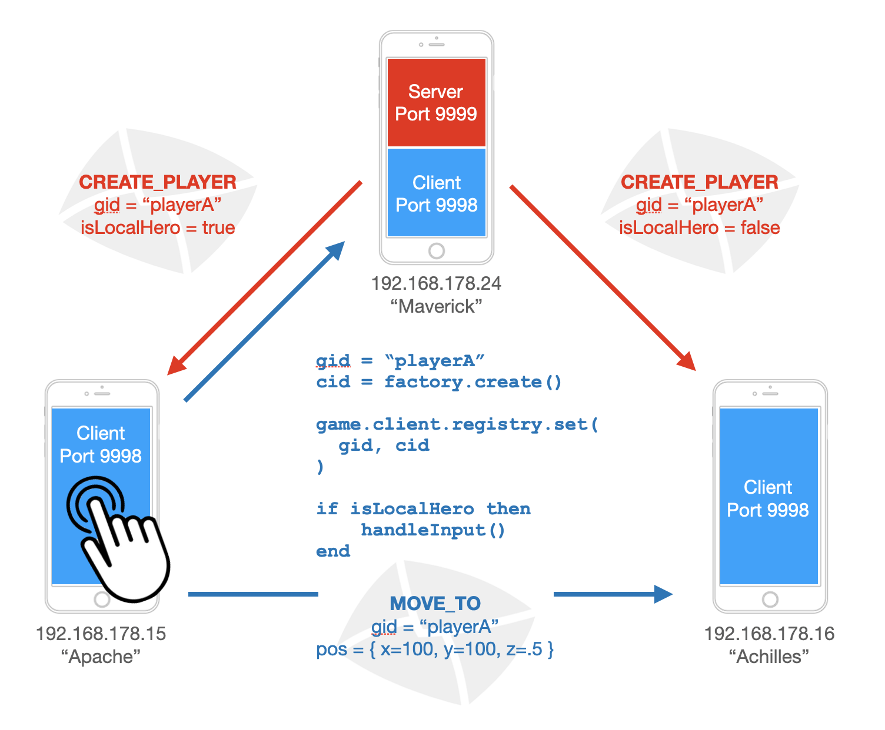

## 1. Multiplayer network games
To write a multiplayer network game, even for just two or three players, is tricky business. As soon as you have to synchronize the state of gameobjects between two different hosts without noticeable latency, things get very complicated. nexus is my take at a framework that helps game developers to focus on their game logic instead of the communication details. 

nexus is intended to work without a central game server. nexus is not for providing chat rooms, provide a central lobby, bring players together, etc. nexus is for setting up ad hoc matches for players on the same local network. No registrations and no memberships are required: the game discovers available players automatically.

## 2. Dependencies
The principles of nexus are independent of a certain engine, but the implementation is for Defold / Lua. Apart from the Defold engine, there are some excellent libraries by Bjoern Ritzl that nexus depends on:

```
https://github.com/britzl/defold-luasocket
https://github.com/britzl/defnet/
https://github.com/britzl/defold-input/archive/master.zip

https://github.com/lharder/deflibs/archive/main.zip
https://github.com/lharder/defgui/archive/master.zip
https://github.com/lharder/screenmaster/archive/master.zip

```

## 3. Example project
nexus comes with a simple example of multiple gameobjects on different hosts interacting with other. 

## 4. nexus concepts
nexus is a framework for peer-to-peer-like games, but from its architecture, it uses a client-to-server approach: on every host, nexus runs a game client and on one of the hosts, there is an additional game server instance. For the developer, it is important to understand the role of each.

### 4.1. Game clients and server
In order to sync the state of gameobjects, the server takes care of all game logic concerning non-player-objects: all artificial inteligence, robot characters and automatic decision making take place on the game server. The spawning of an entity that is supposed to exist on all game clients must be initiated by the game server. 

The game clients, on the other hand, receive instructions from the server and carry them out, creating the actual representations of the gameobjects. The clients control the lifecycle of Defold gameobjects, GUI objects, etc., but they do so according to the commands they receive from the server. The clients can be seen as the hands and feet of the game, the server as its head.

While the server is responsible for all artificial game logic, the clients take care of interacting with their respective user: they handle input and move their respective player object accordingly. nexus then makes sure that this information is transferred to all other clients directly and vice versa.

**nexus multi host communication**


### 4.2. Network sending and receiving
All communication in nexus is transmitted as UDP traffic. Thanks to nexus, the developer has no need to directly send UDP packages but uses the abstraction of an "Envelope" object that wraps up the actual payload and takes care of serializing, addressing, transmitting and deserializing the information as needed.

An envelope is basically a map that takes key/value pairs and represents e.g. the event to spawn a player gameobject at a certain location on the screen. nexus provides the mechanism for defining and transmitting such events with envelope objects. Common defold types like vectors and quaternions are supported just like numbers, strings and booleans. 

Developers must then decide which events are relevant to their game and which information needs to be transmitted.

### 4.3. Global IDs vs. client IDs
One of the problems with running game clients on different hosts is that the  ids Defold generates for gameobjects may differ. However, all parties, game server and clients, must agree on how to address the same objects. 

To solve that problem, the nexus server is the only one to initiate the creation of game objects (at least for all those that need to be in sync on all hosts). The server informs the clients about the need to spawn a new gameobject and as a part of that event data, it provides not only information about position, rotation, etc. but also a global id. Every client then receives the creation event, spawns a new gameobject as defined and registers its local Defold gameobject id with that global id.

So the server can issue subsequent events referring to the global id of an object and the clients, when they receive an event, can lookup and translate global ids to local client side ids and vice versa:

```lua
-- upon receiving a gameobject creation event from the server:
-- register the local id with its global id "playerA"
local cid = factory.create( ... )
GAME.client.registry:set( "playerA", cid )

-- upon receiving any subsequent event:
local cid = GAME.client.registry:getClientId( "playerA" )

-- or, for sending data from one client to the server / other clients
local gid = GAME.client.registry:getGlobalId( cid )
```

### 4.4. Envelopes and events
For sending data over any kind of network, it must be serialized at its source, transmitted and deserialized at its destination. To reliably do so, type information is required, especially for Defold's specific data types e.g. quaternions and vectors. 

nexus allows you to define events which are sent back and forth between game clients and the server or directly between the clients. Just like passing messages between gameobjects in a single game application in Defold, nexus extends that pattern to an application running on several hosts. 

For example, at the start of the game, the server might create an event send to all clients in order to create the correct player object on every participating host. It depends entirely on the specific gamelogic which information needs to be transferred to the clients for that purpose, but all of it will fit in an envelope:

```lua
-- Example of a custom event to make clients create a player gameobject
local Events = {}
function Events.newCreatePlayer( gid, pos, speed )
	-- envelope needs a unique ID and a receiver URL at the destination
	-- optionally, a "sendLastOnly" flag can be provided (see below)
	local env = Envelope.new( 
		"CREATE_PLAYER", "playground:/level", false 
	)
	
	-- all other data is up to the specific game logic
	env:putString( "factory", "playground:/factories#playerfactory" )
	env:putString( "gid", gid )
	env:putVector3( "pos", pos )
	env:putNumber( "speed", speed )
	return env
end
```

Apart from the payload you want to tranfer over the wire, an envelope needs some meta data. An envelope expects a unique ID and a URL as parameters upon creation:

```lua
local id = "CREATE_PLAYER"
local url = "playground:/level"
local env = Envelope.new( id, url )	
```
The ID allows receiving parties to choose the correct action.

With envelopes being transferred from one host to another, it is important that once the event has reached the destination host, it must be propagated to the right entity to handle that event. In the case of this example, the CREATE_PLAYER event should bve handled by a gameobject in the collection "playground" with the id "level" - this is a regular Defold absolute url and you could even send it to a more specific comnponent by adding "#somecomponent".

There is a problem with this, though: if a client wants to send an event to an object such as the player that gets created with this event, it does not know the remote client's gameobject id for it. So, the client is unable top provide an absolute Defold URL for a dynamically spawned gameobject on another host. 

Instead, the client can simply set the global ID of the object as the envelope's URL. Upon receiving an envelope at its destination host, nexus checks if the url is an absolute Defold url containing ":/". If it does not, nexus assumes the string is a global id and tries to replace it with a registered local client gameobject ID.

As a consequence of this behavior, obviously, you must never use ":/" as a part of a global ID you choose.


### 4.5. Game server behaviors
A gameobject in Defold has a script attached with methods that get called on different stages of its lifecycle. As the game logic must be central for all clients, decisions must be taken on the server and transmited to all clients who then carry out corresponding actions. 

To execute serverside logic for gameobjects, you can register behaviors with the server: they define methods for lifecycle methods for initializing, updating, handling events, etc. They correspond closely to what you are used in Defold for gameobjects. And indeed, any non-player-entity in your game will typically have a script attached to its gameobject taking care of clientside actions and a corresponding serverside behavior object to decide what the next move should be.

A behavior can be any object you define that supports these methods:

```lua
-- serverside behavior:
-- defined by you and executing game logic in lifecycle methods
init( self, key )
update( self )
onmessage( evt, ip, port )
final( nextKey )

-- this method is added by nexus for you to switch to another behavior 
-- the object you register is prevented from having such a method
transition( name )
```

In order to register a gameobject, you define it and pass it to the server:

```lua
local RobotIdle = {}
function RobotIdle.init( self )
  -- your logic...
end

function RobotIdle.update( self )
	-- your logic...
end
...

-- global id for this gameobject
local gid = "tx88"
local robotIdle = RobotIdle.new()
GAME.server:putBehavior( gid, robotIdle, "idle" )

local robotHunt = RobotHunt.new()
GAME.server:putBehavior( gid, robotHunt, "huntAndDestroy" )	
```

In order to facilitate switching between different tatctics for a gameobject, every behavior in nexus allows for switching to another behavior that have been registered with a unique key for that gameobject. 

```lua
function RobotIdle.update( self )
	if playerInSight() then		
		self:transition( "huntAndDestroy" )
	end
end
```

For example, a monster may be in idle mode looking for a player and scanning its vicinity. The corresponding actions of idling and scanning may be coded in one behavior object. As soon as a player enters its detection radius, the monster would switch to a hunting behavior in which it tries to catch the player.

if you have a simple gameobject that requires only a single behavior, you do not need to provide a key when you register it:

```lua
GAME.server:putBehavior( gid, Dog.new() )

```

That way, the dog has only one behavior and there is no way to transition to another.


## 5. A simple game
Networking games are pretty complex, so you should definitely have a look at the example project included here. Here is a short overview of the order in which you would normally use the nexus framework to setup your game.

A typical flow is to first ask the user for his callsign, then move to the next screen and start broadcasting to discover available players. The users then select with which of them they wish to setup a match. Confirming their selection, each host starts sending out their proposal for a match. Once all hosts have received matching proposals from the hosts they wish to play with, the match starts.

###5.1. Discovery of peers

You start by instantiating a nexus game object. You provide a gameID that gets transmitted to recognize the same application on other hosts currently looking for peers. 

```lua
-- nexus.game provides access to most functionality
-- to me, it has become good practice to have a 
-- global (yes, shudder... :o) reference to it
GAME = Game.new( "MultiPlayerGame" )
```

To discover other players, the game object first broadcasts a UDP message on the network and listens to likeminded players from other ip addresses.

nexus lets you define a handler function that gets called every time a new host is discovered. The process of negotiating between the different hosts is handled by nexus without the game developer having to take care of it:

```lua
GAME:broadcast( "callsign", function( host )
  ...
end )
```
The broadcast method expects a callsign as parameter to identify the player. It must be unique and it is up to the players / the game application to make sure there is no conflict. Every time a host is discovered, nexus calls the callback method and provides a host object representing the new peer:

```lua
host.ip
host.port
host.callsign
```
It is up to the application to decide when it stops searching for more hosts / potential co-players. 


### 5.2. Match: mutual agreement 
A setup of players to play a round of the game together is considered to be a match. In order to agree on a match, all hosts involved must transmit the same suggestion of callsigns to all other involved hosts. nexus takes care of the internal communication, every host must propose their desired combination to their peers. Once all hosts have transmitted matching proposals, nexus calls a function you provide:

```lua
local match = GAME:newMatch( "Maverick", "Iceman", "Goose" )
match:propose( function() 
  pprint( "All selected players confirmed, let's rock!!!" )
end )
```

###5.3. Setup game level
Starting the game sets up the communication between the server and the clients on the different hosts. On every host, one client is instantiated and nexus chooses one of the hosts to also take over the role of a server.

It basically does not matter which one of the hosts becomes the server. By default, nexus selects the one host whose ipv4 address on the network has the highest last octet value. This is completely arbitrary, but easy for every host to agree on. 

####5.3.1. Serverside

Setting up a new level is the job of the server. As always in Defold, you load the appropriate collection of gameobjects. In one (or more) of them, you start the game and create the required events:

```lua
function Events.newCreatePlayer( gid, pos, speed, name, isLocalHero )
	local env = Envelope.new( Events.CREATE_PLAYER, "playground:/level" )
	env:putString( "factory", "playground:/factories#playerfactory" )
	env:putString( "gid", gid )
	env:putVector3( "pos", pos )
	env:putString( "name", name )
	env:putNumber( "speed", speed )
	env:putBool( "isLocalHero", isLocalHero )
	return env
end
```

```lua
function init( self )
	-- if needed, pass in preferred ip to be the server
	GAME:start()

	-- create serverside objects to run the game
	-- both server and client run the same code: ignore if this is not 
	-- the server instance. nexus makes sure that isServer() returns 
	-- the right answer depending on the host and role as client/server
	if GAME:isServer() then
	
		-- create one local hero on every game host / client ------------
		-- who receives and transmits input from his user to all other hosts 
		local evtLocalHero = Events.newCreatePlayer( 
			callsign, vmath.vector3( pos.x, pos.y, .5 ), speed, callsign, true 
		)
		local host = GAME.hosts:get( callsign )
		GAME.server:send( host.ip, evtLocalHero )

		-- for all other hosts, this hero is only a drone to 
		-- be controlled by somebody somewhere else
		local evtRemoteHero = Events.newCreatePlayer( 
			callsign, vmath.vector3( pos.x, pos.y, .5 ), speed, callsign, false 
		)
		GAME.server:sendToClientsExcept( host.ip, evtRemoteHero )

	end
	
	
end

```

**Player callsigns:** You have access to the other hosts playing with you via the GAME.match.proposal object: it contains a list with the callsigns of all players in the game. 

**Hosts in the game:** To get access to a given host, you call:

```lua
GAME.hosts:get( callsign )
```
**Send an event to a host:** To send events to other hosts, both GAME.server and GAME.client offer several methods:

```lua
-- send to the host with the given IP address. 
-- As it is the server that provides this method, the event
-- will be sent to the client at the given ip address by default.
-- Optionally, you can provide any other port, e.g.
-- Game.SERVER_PORT or Game.CLIENT_PORT
--
-- send to Client:
GAME.server:send( host.ip, event )
-- send to server at ip address:
GAME.server:send( host.ip, event, Game.SERVER_PORT )

-- send to all clients except the one with the given ip
-- Typically used to send the same event to all clients
-- except one that must receive a special variant
GAME.server:sendToClientsExcept( ip, event )

```

**Important:** Beware when you use the GAME.server object: it is only avalable on the host that runs the server instance, obviously.

On all hosts, you have access to the GAME.client object. It, too, provides methods to send events to the other hosts. By default, a client sends events to the server, unless you provide a different port:

```lua
Client:send( ip, event, [port] )
Client:sendToOtherClients( event )
Client:sendToServer( event )

```

####5.3.2. Clientside

On the client, a gameobject in the collection is responsible for 


----------------
- Game.new( gameId )
- Game.getLocalhostIP()

- Game:broadcast( callsign, callbackOnFound )
- Game:addHost( host )
- Game:getHost( callsign )
- Game:getHostByIp( ip )
- Game:newMatch( ... )
- Game:isServer()
- Game:getServerHost()

- Game:start()
- Game:update()


